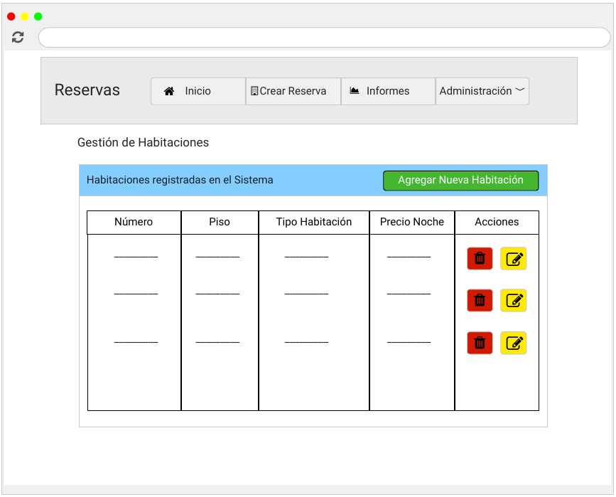
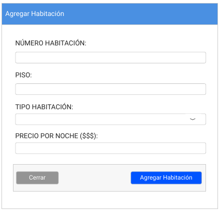
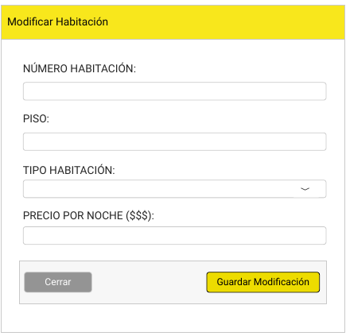
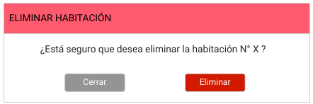
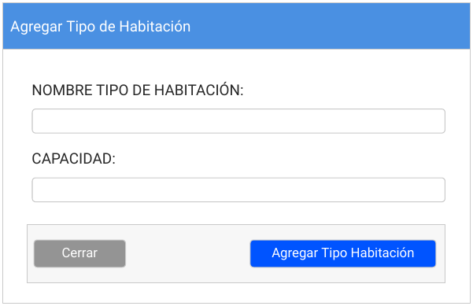

# Documento de diseño y planificación 
Este documento posee el diseño y la planificación tentativa para el desarrollo del sistema a lo largo de la iteración 2.

**Lider de la iteración**: Lacheski, Martin Anibal.

## Backlog de iteración
Conforme a lo que respecta la iteración 2, se han elegido las siguientes historias de usuario.

**G7**: Como gerente, quiero poder modificar tipos de habitaciones llegado al caso de que las características de éstas varíen en el tiempo   
**G8**: Como gerente quiero poder asociar una habitación a un tipo de habitación para poder clasificarlas.  
**G9**: Como gerente quiero poder eliminar un tipo de habitación en caso de que este no se utilice más.   
**G10**: Como gerente quiero poder listar los tipos de habitaciones que tenga registradas para poder verlas rápidamente. 
**G12**: Como gerente, quiero poder agregar a nuevos empleados para poder registrar a quienes trabajan en el establecimiento. 
**G13**: Como gerente, quiero poder modificar los datos de empleados ya registrados llegado al caso que se carguen incorrectamente o los mismos cambien sus datos personales. 
**G14**: Como gerente, quiero poder dar de baja a empleados registrados llegado al caso de que dejen de trabajar en el establecimiento. 
**G15**: Como gerente, quiero poder visualizar una lista de los empleados que se tienen registrados para poder ver rápidamente quienes conforman el equipo de trabajo actual 
**E7**: Como empleado quiero poder agregar nuevos huspedes de manera tal que se pueda tener un registro de los mismos. 
**E10**: Como empleado quiero poder obtener un listado de todos los huespedes registrados en el sistema hasta la fecha actual.

## Trabajo en equipo y Tareas
Las tareas, desarrolladas en equipo, se dividen de la siguiente manera, siendo cada columna un miembro del equipo.

| Quiroga Leonardo | Martin Lacheski | Jolu |
| -----------| ------------------|-----------------|

## Diseño OO

## WireFrame

- Lista de habitaciones *(refleja tambien tipos de habitaciones)*

- Agregar Habitación  

- Modificar Habitación  

- Eliminar Habitación  

- Agregar Tipo de Habitación  

## Casos de Uso

1. Agregar una Habitación
    - El usuario visita la página web y se dirige a la sección de habitaciones, haciendo clic en el dropbox de Administación > Gestión de Habitaciones.
    - El sistema lo redirecciona a la pantalla apropiada.
    - El usuario hace clic en el botón "Agregar Nueva Habitacioń". 
    - El sistema despliega un formulario tipo modal con los datos necesarios para una habitación.
    - El usuario completa los campos requeridos en el formulario desplegado y hace clic en "Agregar Habitación".
    - El sistema esconde el modal y actualiza la página para que la nueva habitación se vea reflejada en el listado.

2. Modificar una habitación
    - El usuario, en la sección de habitaciones, hace clic en el botón de edición que se encuentra en cada renglón el cual representa una habitación cargada.
    - El sistema despliega un formulario tipo modal con los datos precargados de la habitación elegida.
    - El usuario modifica los campos que cree apropiados modificar y hace clic en el botón "Guardar Modificación"
    - El sistema esconde el modal, modifica los datos en la base de datos y actualiza la página para reflejar los datos modificados en el listado.

3. Eliminar una habitación
    - El usuario, en la sección de habitaciones, hace clic en el botón de eliminación que se encuentra en cada renglón el cual representa una habitación cargada.
    - El sistema despliega un modal a modo de confirmación indicando en un mensaje si se está seguro de eliminar la habitación.
    - El usuario hace clic en el botón "Eliminar". 
    - El sistema esconde el modal, elimina los datos en la base de datos y actualiza la página para reflejar los datos modificados en el listado.

4. Agregar un Tipo de Habitación
     - El usuario visita la página web y se dirige a la sección de tipos de habitaciones, haceidno clic en el dropbox de Administación > Gestión de Tipos de Habitaciones.
    - El sistema lo redirecciona a la pantalla apropiada.
    - El usuario hace clic en el botón "Agregar Nuevo Tipo de Habitacioń". 
    - El sistema despliega un formulario tipo modal con los datos necesarios para un tipo de habitación.
    - El usuario completa los campos requeridos en el formulario desplegado y hace clic en "Agregar Tipo Habitación".
    - El sistema esconde el modal y actualiza la página para que la nueva habitación se vea reflejada en el listado.
