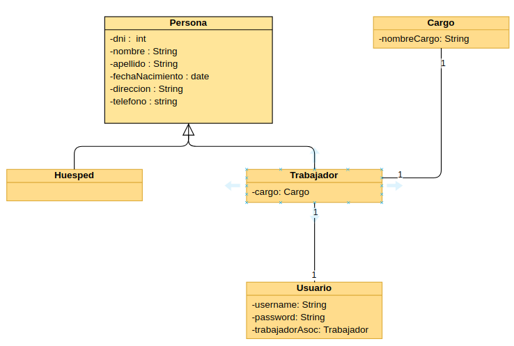
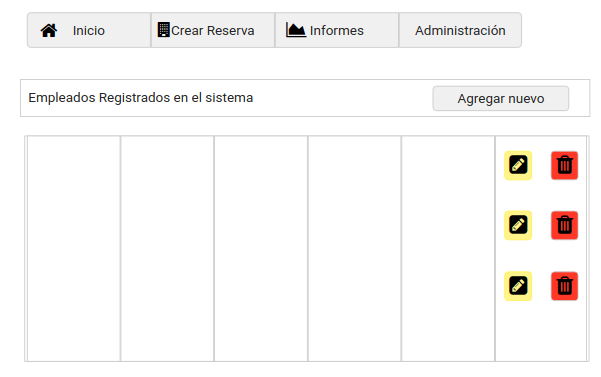
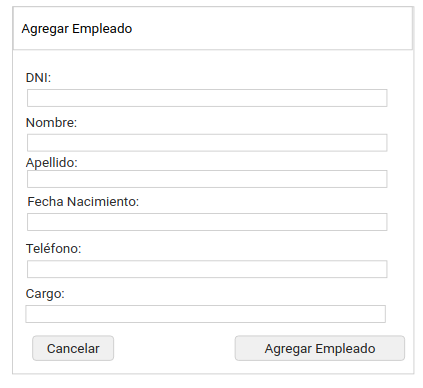
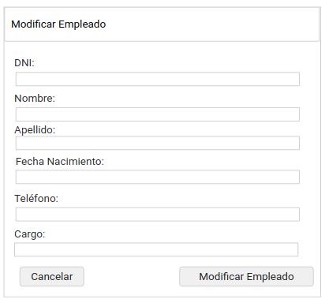
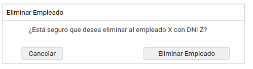

# Documento de diseño y planificación 
Este documento posee el diseño y la planificación tentativa para el desarrollo del sistema a lo largo de la iteración 2.

**Lider de la iteración**: Lacheski, Martin Anibal.

## Backlog de iteración
Conforme a lo que respecta la iteración 2, se han elegido las siguientes historias de usuario.

**G7**: Como gerente, quiero poder modificar tipos de habitaciones llegado al caso de que las características de éstas varíen en el tiempo   
**G8**: Como gerente quiero poder asociar una habitación a un tipo de habitación para poder clasificarlas.  
**G9**: Como gerente quiero poder eliminar un tipo de habitación en caso de que este no se utilice más.   
**G10**: Como gerente quiero poder listar los tipos de habitaciones que tenga registradas para poder verlas rápidamente. 
**A1**: Como administrador, quiero poder crear nuevos usuarios en el sistema de manera tal que si un Gerente o Empleado no tiene usuario, no pueda usar el sistema.  
**A2**: Como Administrador, quiro poder asociar un usuario a un empleado o Gerente de manera tal que se sepa qué usuario pertenece a qué trabajor. 
**G12**: Como gerente, quiero poder agregar a nuevos empleados para poder registrar a quienes trabajan en el establecimiento. 
**G13**: Como gerente, quiero poder modificar los datos de empleados ya registrados llegado al caso que se carguen incorrectamente o los mismos cambien sus datos personales. 
**G14**: Como gerente, quiero poder dar de baja a empleados registrados llegado al caso de que dejen de trabajar en el establecimiento. 
**G15**: Como gerente, quiero poder visualizar una lista de los empleados que se tienen registrados para poder ver rápidamente quienes conforman el equipo de trabajo actual 

## Trabajo en equipo y Tareas
Las tareas se dividen de la siguiente manera, siendo cada columna un miembro del equipo.

| Quiroga Leonardo | Martin Lacheski | Jose Luis Montejano |
| ----- | ------ |------ |
| Creación de clases Empleado, Persona, Trabajador, Huesped | Codificación en capa logica y persistencia referente a la eliminación y modificación de Tipos de Habitación | Codificación en capa de templates para disposición del listado de Tipos de Habitación |
| Codificación en capa Servlets para obtención y tratado de datos de Tipos de Habitación | Creación de clases Cargo y Usuario | Codificación de Formularios para ALTA y modificación de Empleados en capa de templates |
| Codificación en capa de templates para disposición del listado de Empleados | Codificación en capa de Servlets para la obtención y tratado de datos de Empleados | Codificación en capa Persistencia y Lógica para instancia de objetos y almacenamiento. 
| Codificación en capa lógica y persistencia para la eliminación de un empleado | Codificación en capa template para eliminación de Empleado | Codificación en capa Logica y Persistencia para ALTA de usuarios 
| Codificación en capa template de formualario para ALTA de usuario | Codificación en capa Servlet para obtención y tratado de datos de Usuario

## Diseño OO

## WireFrame

- Lista de Empleados  

- Agregar Empleado  

- Modificar Empleado  

- Eliminar Habitación  

- Agregar Usuario  

## Casos de Uso
*(Se omiten casos de uso asociados a Tipo de Habitación debido a su gran semenjanza con los casos de uso de habitaciones, ademas de compartir la mayoría de los elementos gráficos)*

1. Agregar un Empleado
    - El usuario visita la página web y se dirige a la sección de Empleados, haciendo clic en el dropbox de Administación > Gestión de Empleados.
    - El sistema lo redirecciona a la pantalla apropiada.
    - El usuario hace clic en el botón "Agregar Nuevo Empleado". 
    - El sistema despliega un formulario tipo modal con los datos necesarios para un Empleado.
    - El usuario completa los campos requeridos en el formulario desplegado y hace clic en "Agregar Empleado".
    - El sistema esconde el modal y actualiza la página para que el nuevo empleado se vea reflejado en el listado.

2. Modificar un Empleado
    - El usuario, en la sección de Empleados, hace clic en el botón de edición que se encuentra en cada renglón el cual representa un Empleado cargado.
    - El sistema despliega un formulario tipo modal con los datos precargados del Empleado elegido.
    - El usuario modifica los campos que cree apropiados modificar y hace clic en el botón "Modificar Empleado"
    - El sistema esconde el modal, modifica los datos en la base de datos y actualiza la página para reflejar los datos modificados en el listado.

3. Dar de baja a un empleado
    - El usuario, en la sección de Empleados, hace clic en el botón de eliminación que se encuentra en cada renglón el cual representa un Empleado cargado.
    - El sistema despliega un modal a modo de confirmación indicando en un mensaje si se está seguro de dar de baja al Empleado.
    - El usuario hace clic en el botón "Eliminar Empleado". 
    - El sistema esconde el modal, elimina los datos en la base de datos y actualiza la página para reflejar los datos modificados en el listado.

4. Agregar un nuevo Usuario
    - El usuario visita la página web y se dirige a la sección de Usuarios, haciendo clic en el dropbox de Administación > Gestión de Usuarios.
    - El sistema lo redirecciona a la pantalla apropiada.
    - El usuario hace clic en el botón "Agregar Nuevo Usuario". 
    - El sistema despliega un formulario tipo modal con los datos necesarios para un Usuario.
    - El usuario completa los campos requeridos en el formulario desplegado y hace clic en "Agregar Usuario".
    - El sistema esconde el modal y actualiza la página para que el nuevo usuario se vea reflejada en el listado.
