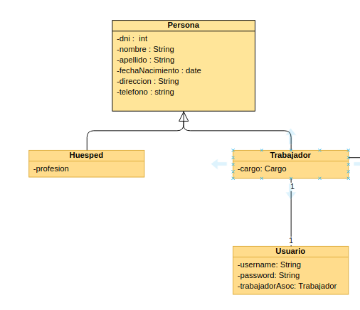
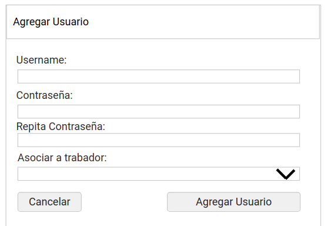

# Documento de diseño y planificación 
Este documento posee el diseño y la planificación tentativa para el desarrollo del sistema a lo largo de la iteración 3.

**Lider de la iteración**: Quiroga, Hugo Leonardo.

## Backlog de iteración
Conforme a lo que respecta la iteración 3, se han elegido las siguientes historias de usuario.

__Pendientes de iteración 2__:
- **A1**: Como administrador, quiero poder crear nuevos usuarios en el sistema de manera tal que si un Gerente o Empleado no tiene usuario, no pueda usar el sistema.  
- **A2**: Como Administrador, quiro poder asociar un usuario a un empleado o Gerente de manera tal que se sepa qué usuario pertenece a qué trabajor. 

__Correspondientes a iteración 3__: 
**A3**: Como administrador, quiero poder modificar los datos de los usuarios en el sistema en caso de que los Empleados o Gerentes se olviden, pierdan o comprometan sus contraseñas o nombre de usuario.  
**A5**: Como administrador, quiero poder visualizar una lista de los usuarios que se tienen registrados para poder ver rápidamente a los que se tienen registrados. Dicha lista debe tener a qué empleado o Gerente está asociado cada usuario.
 
**E7**: Como empleado quiero poder agregar nuevos huspedes de manera tal que se pueda tener un registro de los mismos. 
**E8**: Como empelado quiero poder modificar datos de huespedes llegado al caso que se carguen incorrectamente o los mismos cambien sus datos personales.  
**E9**: Como empleado quiero poder dar de baja a huespedes en caso de que sus datos ya no sean necesarios en el establecimiento.  
**E10**: Como empleado quiero poder obtener un listado de todos los huespedes registrados en el sistema hasta la fecha actual.  

Dichas historias de usuario conforman un ABM básico de un empleado como así tambien el ABM se un usuario (aún sin aplicar permisos). 

## Trabajo en equipo y Tareas
Las tareas, desarrolladas en equipo, se dividen de la siguiente manera, siendo cada columna un miembro del equipo.

| Quiroga Leonardo | Martin Lacheski | José Luis Montejano|
| -----------| ------------------|-----------------|
|Creación de clase Usuario| Codificación en capa Servlets para obtención y tratado de datos de Usuarios | Codificación de Formualrios para ALTA y modificación de Huespedes en capa de templates |
| Codificación en capa Persistencia y Lógica para instancia de objetos y almacenamiento. | Codificación en capa template para eliminación de Huesped | Codificación en capa template de formualario para ALTA de usuario|
 Codificación en capa de templates para disposición del listado de Huespedes|  Codificación en capa Servlet para obtención y tratado de datos de Usuario|Codificación en capa logica y persistencia referente a la eliminación y modificación de objetos |
 | Creación de clase Huesped

## Diseño OO

## WireFrame

- Lista de huespedes *(refleja tambien lista de usuarios)*

- Agregar Huesped  

- Modificar Huesped  

- Eliminar Huesped **(se excluye pantalla de eliminación de usuairo debido a su similaridad con ésta)**  

- Agregar Usuario **(se excluye pantalla de edición debido a su similaridad con ésta)**  

## Casos de Uso

1. Agregar un Huesped
    - El usuario visita la página web y se dirige a la sección de Huespedes, haciendo clic en el dropbox de Administación > Gestión de Huesped.
    - El sistema lo redirecciona a la pantalla apropiada.
    - El usuario hace clic en el botón "Agregar Nuevo Huesped". 
    - El sistema despliega un formulario tipo modal con los datos necesarios para un Huesped.
    - El usuario completa los campos requeridos en el formulario desplegado y hace clic en "Agregar Huesped".
    - El sistema esconde el modal y actualiza la página para que la nueva habitación se vea reflejada en el listado.

2. Modificar un Huesped
    - El usuario, en la sección de Huespedes, hace clic en el botón de edición que se encuentra en cada renglón el cual representa un huesped cargado.
    - El sistema despliega un formulario tipo modal con los datos precargados del huesped elegido.
    - El usuario modifica los campos que cree apropiados modificar y hace clic en el botón "Guardar Modificación"
    - El sistema esconde el modal, modifica los datos en la base de datos y actualiza la página para reflejar los datos modificados en el listado.

3. Dar de baja a un huesped.
    - El usuario, en la sección de huespedes, hace clic en el botón de eliminación que se encuentra en cada renglón el cual representa un huesped cargado.
    - El sistema despliega un modal a modo de confirmación indicando en un mensaje si se está seguro de eliminar los datos del huesped.
    - El usuario hace clic en el botón "Eliminar". 
    - El sistema esconde el modal, da de baja al huesped y actualiza la página para reflejar los datos modificados en el listado.

4. Agregar un nuevo Usuario
     - El usuario visita la página web y se dirige a la sección de Usuarios, haciendo clic en el dropbox de Administación > Gestión de Usuarios.
    - El sistema lo redirecciona a la pantalla apropiada.
    - El usuario hace clic en el botón "Agregar Nuevo Usuario". 
    - El sistema despliega un formulario tipo modal con los datos necesarios para un Usuario.
    - El usuario completa los campos requeridos en el formulario desplegado y hace clic en "Agregar Usuario".
    - El sistema esconde el modal y actualiza la página para que el nuevo usuario se vea reflejada en el listado.

5. Modificar un Huesped
    - El usuario, en la sección de Usuarios, hace clic en el botón de edición que se encuentra en cada renglón el cual representa un usuario cargado.
    - El sistema despliega un formulario tipo modal con los datos precargados del usuario elegido.
    - El usuario modifica los campos que cree apropiados modificar y hace clic en el botón "Guardar Modificación"
    - El sistema esconde el modal, modifica los datos en la base de datos y actualiza la página para reflejar los datos modificados en el listado.

6. Dar de baja a un huesped.
    - El usuario, en la sección de Usuarios, hace clic en el botón de eliminación que se encuentra en cada renglón el cual representa un usuario cargado.
    - El sistema despliega un modal a modo de confirmación indicando en un mensaje si se está seguro de eliminar los datos del usuario.
    - El usuario hace clic en el botón "Eliminar". 
    - El sistema esconde el modal, da de baja al usuario y actualiza la página para reflejar los datos modificados en el listado.