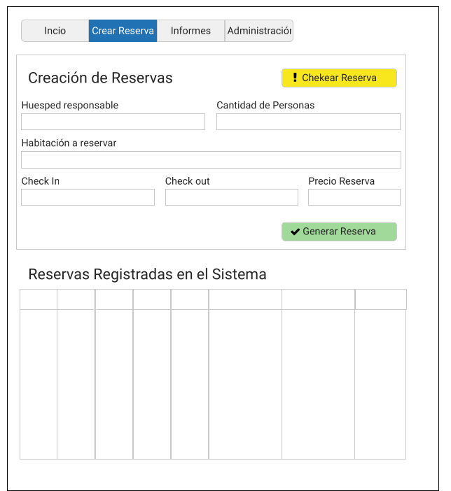
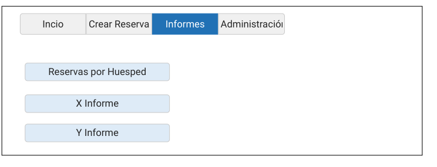
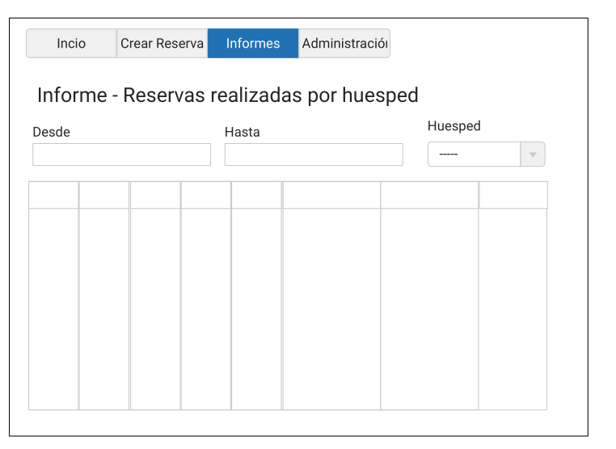

# Documento de diseño y planificación 
Este documento posee el diseño y la planificación tentativa para el desarrollo del sistema a lo largo de la iteración 4.

**Lider de la iteración**: Lacheski, Martín Aníbal.

## Backlog de iteración
Conforme a lo que respecta la iteración 4, se han elegido las siguientes historias de usuario.

__Correspondientes a iteración 4__: 
**E1**: Como empleado, quiero poder registrar una nueva reserva de habitación para poder saber qué huespedes serán hospedados y quien será el responsable de la misma.  
**E2**: Como empleado, quiero poder registrar cuándo cerá el chek-in de una reserva y cuando será el check-out de manera que se pueda saber el periodo de tiempo en el que las habitaciones estarán ocupadas.
 
**E3**: Como empleado, quiero poder saber si un rango de fechas de reservación para una habitación determinada se solapa con otra reservación, de manera tal que se pueda redirecionar al huesped hacia otra habitación. 
**E4**: Como empleado, quiero poder saber si la cantidad de personas en una reserva sobrepasa la capacidad de la habitación para poder informarle al huesped que debe elegir otra habitación, o que haga otra reserva.  
**E5**: Como empleado, quiero saber el monto de la reserva concorde al tipo de habitación y a la cantidad de días de estancia en el establecimiento.  
**E6**: Como empleado, quiero poder cancelar una reserva en casos en donde el huesped decida hacerlo.  
**E12**: Como empleado quiero poder obtener un listado de todas las reservas realizadas por un determinado huesped en un periodo desde/hasta.
**A4**: Como administrador, quiero poder dar de baja a un usuario del sistema de manera tal que pueda revocar completo acceso a dicho Empleado/Gerente asociado al usuario en cuestión.

> Adicional a las historias de usuario, se ponen en marcha dos manejos de errores importantes dentro del sistema. La nomenclatura de ambos será ER seguido de un número.  
**ER1**: Hacer transparente al usuario el ingreso de registros repetidos, con algún mensaje de error. 
**ER2**: Hacer transparente al usuario la dependencia de registros, en caso de que se quiera eliminar uno que dependa de otro.

Dichas historias de usuario (y tareas sobre manejo de errores) conforman un ABM complejo de reserva, como así tambien la implementación de los primeros reportes.

## Trabajo en equipo y Tareas
Las tareas, desarrolladas en equipo, se dividen de la siguiente manera, siendo cada columna un miembro del equipo.

| Quiroga Leonardo | Martin Lacheski | José Luis Montejano|
| -----------| ------------------|-----------------|
|Codificacón de formulario de reserva en capa template | Codificación en capa Servlets para obtención y tratado de datos de Reservas | Creación de clase Reservas |
| Codificación en capa Persistencia y Lógica para instancia de objetos Reserva y almacenamiento. | Codificación en capa template para Cancelación de Reserva | Codificación en capa template de visualización de informe|
 Codificación en capa de templates para baja de Usuario| Codificación en capa Logica y Persistencia de búsqueda y filtro de datos para informes |Codificación en capa logica y persistencia referente al tratado de errores de duplicidad y de eliminación de registros dependientes |
 | Codificación en capa template de muestra al usuario respecto a los errores de duplicidad y eliminación de registros dependientes |

## Diseño OO

## WireFrame

- Generar Reserva

- Seleccionar informe

- Informe Reservas por Huesped

## Casos de Uso

1. Generar Reserva
    - El usuario visita la página web y se dirige a la sección de Crear Reserva, haciendo clic en el botón con el respectivo nombre.
    - El sistema lo redirecciona a la pantalla apropiada.
    - El usuario completa los campos de Huesped Responsable, Cantidad de Personas y Habitación a reservar, luego presiona el botó nde Checkear Reserva para comprobar que dicha habitación para dicha cantidad de personas está disponible. 
    - El sistema le confirma que la habitación está disponible. 
    - El usuario sigue completando el formulario, indicando la fecha de chick-in y chick-out. 
    - El sistema calcula el precio de la reserva basándose en la cantidad de días y el precio de dicha habitación por noche.
    - El usuario presiona el botón Generar Reserva
    - El sistema checkea que la fecha de check-in sea menor a la fecha de check-out y si lo es, genera la reserva.

2. Obtener Informe
    - El usuario visita la página web y se dirige a la sección de Informes, haciendo clic en el botón con el respectivo nombre.
    - El sistema lo redirecciona a la pantalla apropiada.
    - El usuario presiona en alguno de los botones señalando qué informe quiere. En este caso, reservas realizadas por un determinado huesped.
    - El sistema lo redirecciona a la pantalla apropiada.
    - El usuario sleeciona un periodo desde - hasta, el huesped y presiona el botón "Informe". 
    - El sistema despliega los registros requeridos.