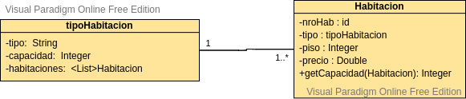

# Documento de diseño y planificación (iteración 1)

Este documento posee el diseo y la planificación tentativa para el desarrollo del sistema a lo largo de la iteración 1.

**Lider de la iteración**: Quiroga, Hugo Leonardo.

## Backlog de iteración
Conforme a lo que respecta la iteración 1, se han elegido las siguientes historias de usuario.

**G1**: Como gerente, quiero poder agregar habitaciones al sistema para poder tener un registro de las mismas.   
**G2**: Como gerente, quiero poder eliminar una habitación del sistema en caso de que la misma no se utilice más o se haya cargado incorrectamente.  
**G3**: Como gerente, quiero poder modificar los datos de una habitación en caso de que las mismas sufran cambios dentro del establecimiento.  
**G6**: Como gerente, quiero poder agregar nuevos tipos de habitaciones de manera tal que las habitaciones sean clasificables. 

Dichas historias de usuario conforman un ABM básico de una habitación como así tambien el alta de un tipo de habitación. 

## Trabajo en equipo y Tareas
Las tareas, desarrolladas en equipo, se dividen de la siguiente manera, siendo cada columna un miembro del equipo.

| Quiroga Leonardo | Martin Lacheski | Jose Luis Montejano|
| -----------| ------------------|-----------------|
| Elaborar la clase Habitación. | Establecer conexión desde el entorno de desarrollo de Java a la BD (librerías, configuraciones, etc). | Creación de formulario inicial para el alta de la habitación.
| Codificación de lógica en capa de negocio para captar datos desde el cliente| Codificación de lógica en capa de modelos para almacenar los datos captados en capa de negocio | Codificación de controles en el formulario para depuración de datos (campos con números que solamente acepten números, etc) |
| Codificación de lógica en capa de modelos y negocio para obtener las habitaciones cargadas. | Elaboración estética de listado en template | Codificación en capa de modelos para obtención de una habitación en específico|
| Codificación en capa de negocio y template para elegir una habitación en específico la cual será expuesta en el mismo formulario de alta de habitación. | Elaboración de clase tipoHabitacion y relación con clase Habitacion| Creación de formulario de alta de tipoHabitación | Codificación de lógica en capa de negocio y modelos para almacenar los datos cargados en el formulario de alta de tipoHabitacion|
| Elaboración de botón de "Eliminar", ubicado en cada renglon del listado de habitaciones | Codificación en capa de negocio y modelos para eliminación de una habitación | Codificación de control para no cargar habitaciones y/o tipos de habitaciones repetidas |

## Diseño OO

## Casos de Uso

## WireFrame
